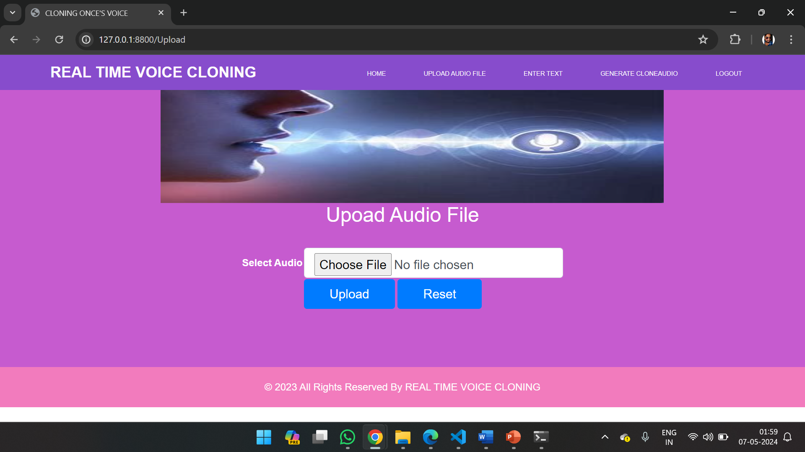

## Voice Cloning Project

## Project Overview

This project presents a real-time voice cloning system implemented using deep learning techniques and the Django web framework. The system allows users to upload audio samples and enter text prompts for generating synthetic speech in the uploaded voice. Leveraging state-of-the-art models such as SpeechT5, the system performs text-to-speech synthesis while preserving the speaker's unique characteristics. Additionally, it incorporates speaker recognition functionality to ensure accurate cloning by extracting speaker embeddings using an EncoderClassifier model. The synthesized speech is rendered in real-time and can be listened to directly on the web interface. The project aims to provide a seamless and user-friendly platform for voice cloning applications, opening avenues for personalized virtual assistants, dubbing in media, and other innovative use cases.

Ethical considerations regarding privacy and consent are addressed, emphasizing responsible deployment of voice cloning technology. Evaluation of the system's performance demonstrates its effectiveness in generating high-quality synthesized speech with minimal latency.

## Features

- Real-time voice cloning
- User-friendly web interface
- Text-to-speech synthesis preserving unique voice characteristics
- Speaker recognition for accurate cloning
- Real-time playback and downloadable synthetic speech

## Ethical Considerations

Ethical considerations regarding privacy and consent are addressed, emphasizing responsible deployment of voice cloning technology.

## Project Setup

### Prerequisites

- Python 3.x
- Django
- Required Python packages (see `requirements.txt`)

### Installation

1. Clone the repository:
    ```bash
    git clone https://github.com/pattanzaheerahmed/Voice-Cloning.git
    cd Voice-Cloning
    ```

2. Create and activate a virtual environment:
    ```bash
    python -m venv venv
    source venv/bin/activate  # On Windows, use `venv\Scripts\activate`
    ```

3. Install the required packages:
    ```bash
    pip install -r requirements.txt
    ```

### Running the Application

1. Navigate to the project directory and start the Django server:
    ```bash
    python manage.py runserver
    ```

2. Open your web browser and go to `http://127.0.0.1:8000`.

### Usage

1. **Home Page**: 
    - Login or register a new user account.
    

2. **Upload Audio**: 
    - Upload the audio sample to be cloned.
    

3. **Enter Text**: 
    - Enter the text to be synthesized in the uploaded voice.
    

4. **Generated Voice**: 
    - Listen to the generated voice and download the audio file.
    

## Screenshots

### Terminal - Starting the Application


### Home Page - User Interface


### Collecting Audio


### Entering Text


### Generated Cloned Voice Output


### Background Data Processing


## Conclusion

The GENERATIVE CLONING ONE’S VOICE project has been successfully developed to generate fake or mimic voices instead of original voices. This project clears the disadvantages of previous projects and addresses those errors, executing successfully. It contains a very user-friendly ecosystem and provides a good user experience through a web-based interface.
